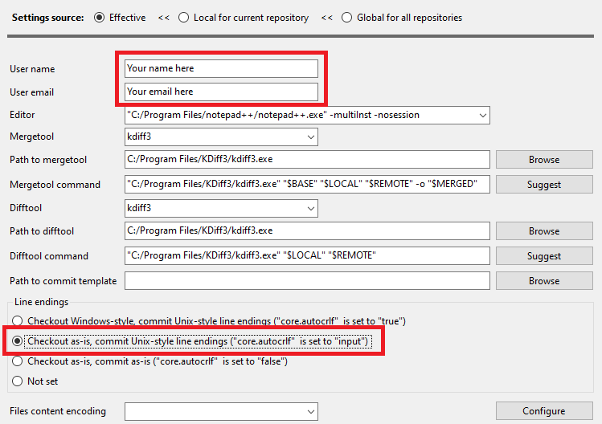
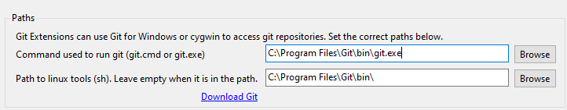

This page describes the process of how we set up development environments at Yoast on a Windows machine.

**Note: These instructions assume you're working with Windows 10 Professional or Enterprise.**

## Generic tools

### Git / GitHub
Within Yoast, Git is used for version control. Don't know how Git works? Check out [this tutorial](https://try.github.io/levels/1/challenges/1). Our Git repositories are all hosted on GitHub. If you don't have one already, go and [create an account](https://github.com/signup).
### KDiff3
[KDiff3](https://sourceforge.net/p/kdiff3/wiki/Home/) helps solving merge conflicts.
### NotePad++
[NotePad++](https://notepad-plus-plus.org/downloads/) a developer's swiss army knife.
### Git
[GitExtensions](https://github.com/gitextensions/gitextensions/releases/) is a powerful Git GUI which you'll need to access our Git Repositories from a Windows machine
After installation, GitExtensions will alert you of any missing configurations and you'll need to configure any missing fields. One of the first steps would be to download [Git](https://git-scm.com/downloads).

We recommend to configure Git to use NotePad++ and to enable the "Git from the command line and also from 3rd-party software" option. Please make sure to set the line endings to **Commit Unix-style line endings**, as you'll be working with teammates whose environment is not compatible with Windows CRLF newlines.
Git can install the MinTTY terminal window which is far more flexible than the Windows default console - please do. 
In the last step of the wizard, we recommend using the Git Credential Manager.

We recommend using KDiff3 and NotePad++ as seen in this screenshot:
  

Please make sure to set the line endings to **Commit Unix-style line endings**, as you'll be working with teammates whose environment is not compatible with Windows CRLF newlines.

Git needs access to user tools, you'll need to configure them in GitExtensions:  
 

Documentation on how to configure your local Git setup and how to add your SSH key to GitHub can be found [here](https://help.github.com/articles/set-up-git) and [here](https://help.github.com/articles/generating-ssh-keys).

[Add a global git ignore file](/development/standards/version-control-conventions.md#global-git-ignore) so you don't accidentally add system files to the repository.

### Docker
At Yoast, we make use of [Docker](https://docs.docker.com/docker-for-windows/install/) as the foundation for our development setup. To get developers up and running faster, we created [our own development setup](https://github.com/Yoast/plugin-development-docker), based on Docker, that you can freely use.

### MySql Workbench
To manage and search your database in an easy and quick way, use [Mysql Workbench](https://dev.mysql.com/downloads/workbench/).

To find out how to connect to the Docker database, [check out the instructions](https://github.com/Yoast/plugin-development-docker#connecting-to-the-database) on the Plugin Development Docker repository.

### xgettext
xgettext is a GNU internationalization (i18n) and localization (l10n) library. At the time of writing this is needed to build the wordpress-seo plugin.
```shell script
choco install xgettext
```

## Project tools

### PHP
As the plugins are written in PHP, it is necessary to have PHP locally installed.
We recommend following [Jeff Geerling's excellent guide on installing and configuring PHP on windows](https://www.jeffgeerling.com/blog/2018/installing-php-7-and-composer-on-windows-10)
Make sure you add your php folder to your path environment variable (Press Start > type 'edit environment variables' > click the **Path** line, click edit > New > Browse > navigate to the folder that contains *php.exe* and hit OK until the open dialogs go away.

#### Visual Studio Code
[VScode](https://code.visualstudio.com/download) is a very nice cross platform IDE with support for all sorts of languages, including PHP and typescript / javscript that we use.

#### PhpStorm
[PhpStorm](https://www.jetbrains.com/phpstorm/download/#section=windows) is a great IDE for php and related code.

#### Composer
Download and install [Composer for windows](https://getcomposer.org/download/) which allows you to perform project tasks.

#### XDebug 
Carefully follow the steps on the [XDebug installation page](https://xdebug.org/docs/install) in the `Installing on Windows` section.
Be sure to follow the steps at [wordpress-debugging](https://github.com/Yoast/plugin-development-docker/#wordpress-debugging) to configure your local environment.

### JavaScript

#### NodeJS## 
[NodeJS](https://nodejs.org/en/) provides a framework for JavaScript applications 

#### Chocolatey
[Chocolatey](https://chocolatey.org/docs/installation) is a JavaScript package manager

#### NVM-Windows
[nvm-windows](https://github.com/coreybutler/nvm-windows/releases) is not quite the NVM Node Version Manager for windows, but it's doing an excellent impersonation.

### Shell configuration 
open a terminal or powershell window, run 
- `choco install gsudo`. This will download and install a sudo command line option, that allows shell scripts to ask for elevation on windows (i.e. `sudo` for windows).
- `choco install yarn`. Yarn ties our JavaScript code together.
- `npm install -g grunt-cli`. This installs the `grunt` command line interface, which provides a platform to run various build tasks.
- `Set-ExecutionPolicy -ExecutionPolicy RemoteSigned`. This autorizes signed scripts (such as `grunt`) to run.
